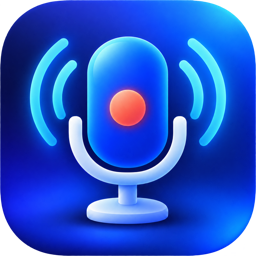
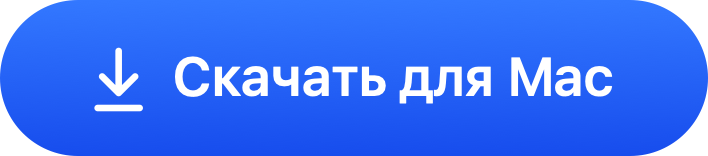
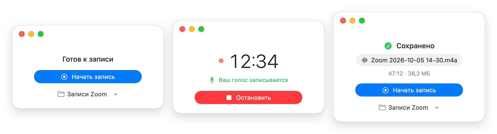

<div align="center">



# Zoom Audio Recorder

Записывает созвоны в Zoom — собеседников и ваш голос — в один аудиофайл.<br>
Одна кнопка. Без облака, подписок и регистрации.

<br>

<a href="https://github.com/smalyu/zoom-audio-recorder/releases/latest/download/Zoom-Audio-Recorder.dmg"></a>

<sub>Бесплатно · macOS 15 и новее · Apple Silicon и Intel</sub>

<br>

<picture>
  <source media="(prefers-color-scheme: dark)" srcset=".github/assets/hero-dark.png">
  
</picture>

</div>

## Почему это удобно

- **Одна кнопка.** Нажали «Начать запись» — идёт запись. Нажали «Остановить» — файл уже в папке.
- **В записи только то, что слышат собеседники.** Ваш микрофон записывается, только когда он включён в Zoom.
- **Запись не потеряется.** Закрылось приложение, сел ноутбук, Mac перезагрузился — запись восстановится при следующем запуске.
- **Всё остаётся у вас.** Приложение не выходит в интернет. Записи хранятся только на вашем Mac.
- **Обычный файл M4A.** Открывается где угодно — легко отправить коллегам или в сервис расшифровки.

## Установка

1. [Скачайте](https://github.com/smalyu/zoom-audio-recorder/releases/latest/download/Zoom-Audio-Recorder.dmg) файл и откройте его.
2. Перетащите приложение в папку «Программы».
3. Откройте его из «Программ».

> **macOS не открывает приложение?** Так бывает с бесплатными программами без платной подписи Apple.
> Откройте «Системные настройки» → «Конфиденциальность и безопасность», пролистайте вниз и нажмите «Все равно открыть». Это нужно сделать один раз.

При первом запуске приложение попросит три разрешения — нажмите «Разрешить» напротив каждого:

| Разрешение | Зачем |
|---|---|
| Звук Zoom | Слышать собеседников. Видео не записывается. |
| Микрофон | Записывать ваш голос. |
| Кнопка mute в Zoom | Понимать, включён ли ваш микрофон в Zoom. |

## Как записать

1. Войдите в созвон Zoom.
2. Нажмите **«Начать запись»**.
3. Когда закончите — **«Остановить»**.

Готовый файл появится в папке **Музыка → Записи Zoom**. Папку можно сменить прямо в окне приложения.

Не забудьте предупредить участников, что ведёте запись.

## Вопросы

<details>
<summary><b>Мой голос не записался</b></summary>
<br>
Проверьте, что в Zoom и в macOS выбран один и тот же микрофон, а панель управления встречей в Zoom видна на экране. Если приложение не смогло понять, включён ли микрофон, оно сохранит его отдельным файлом рядом с записью.
</details>

<details>
<summary><b>Работает с Zoom в браузере, Google Meet или Телемостом?</b></summary>
<br>
Нет, только с приложением Zoom для Mac.
</details>

<details>
<summary><b>Как обновить?</b></summary>
<br>
Скачайте новую версию по кнопке выше и замените приложение в «Программах». Записи останутся на месте.
</details>

<details>
<summary><b>Как удалить?</b></summary>
<br>
Перетащите приложение из «Программ» в Корзину. Записи останутся в папке «Записи Zoom».
</details>

## Для разработчиков

Нужны macOS 15 и Xcode.

```sh
zsh scripts/build.sh    # приложение
zsh scripts/test.sh     # тесты
zsh scripts/package.sh  # DMG
```

---

<sub>[Лицензия MIT](LICENSE). Проект не связан с Zoom Communications, Inc.</sub>
